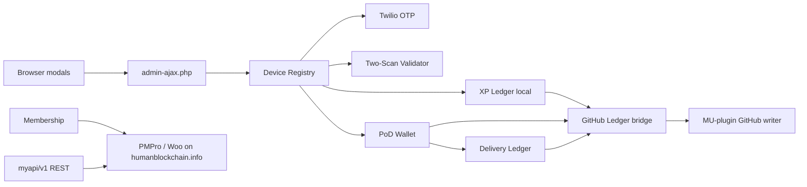

# CPM Humanblockchain — Plugin Documentation

**Plugin name:** CPM Humanblockchain  
**Slug:** `cpm-humanblockchain`  
**Version:** 1.0.6  
**Author:** Codepixelz Media  
**Text domain:** `cpm-humanblockchain`  
**Last updated:** May 2026  
**Deployment:** **humanblockchain.info only** (single-site; not a three-site hub/satellite setup)

---

## Table of contents

1. [Purpose and scope](#1-purpose-and-scope)
2. [System context](#2-system-context)
3. [Architecture](#3-architecture)
4. [Directory structure](#4-directory-structure)
5. [Core concepts](#5-core-concepts)
6. [Database](#6-database)
7. [Configuration](#7-configuration)
8. [User journeys](#8-user-journeys)
9. [AJAX endpoints](#9-ajax-endpoints)
10. [REST API](#10-rest-api)
11. [Ledgers and PoD economics](#11-ledgers-and-pod-economics)
12. [OTP and Twilio](#12-otp-and-twilio)
13. [Public UI](#13-public-ui)
14. [Admin (NWP Gateway)](#14-admin-nwp-gateway)
15. [Integrations](#15-integrations)
16. [Hooks and filters](#16-hooks-and-filters)
17. [Related code outside this plugin](#17-related-code-outside-this-plugin)
18. [Security and operations](#18-security-and-operations)
19. [Troubleshooting](#19-troubleshooting)
20. [Further reading](#20-further-reading)

---

## 1. Purpose and scope

**CPM Humanblockchain** is the primary WordPress plugin for **humanblockchain.info**. The platform runs as a **single property**: this plugin does **not** operate across a three-site hub/satellite model (Smallstreet, Megavoters, HumanBlockchain) in production.

It implements:

- **NWP (New World Penny) onboarding** — device registration, SMS OTP, Discord invite, membership tier selection
- **Serendipity Protocol** — Peace Pentagon branch + Buyer/Seller POC cluster assignment at onboarding (separate from 2-scan PoD)
- **Proof of Delivery (PoD)** — two-scan seller/buyer flow with time and distance validation
- **Local accounting** — delivery wallet (rebates/trade credits), optional XP ledger, delivery audit table — **authoritative on this site**
- **Membership & commerce** — Paid Memberships Pro and WooCommerce on humanblockchain.info
- **Transparency (optional)** — events forwarded to a GitHub ledger via MU-plugin (same repo pattern as before; not a multi-site sync)

Legacy code still contains Smallstreet URL helpers and outbound guards; those paths are **disabled by default** and are **not** part of current operations (see [§7.5 Legacy Smallstreet code](#75-legacy-smallstreet-code-not-used-in-production)).

The plugin header states the product rule explicitly:

| Layer | Role |
|-------|------|
| **NWP** | Onboarding, identity, role readiness, print rights — *not* the financial transaction |
| **YAM-is-ON** | Delivery confirmation, pledge allocation, ledger events — separate universal QR / two-scan flow |

This document describes **implementation in this repository**. Business and macro-economic narrative live in `doc/requirements.md` and `doc/macro-economic-foundation.md`.

---

## 2. System context

### 2.1 Deployment model (current)

| Item | Current state |
|------|----------------|
| **Canonical site** | **humanblockchain.info** (this WordPress install) |
| **Plugin scope** | All NWP, PoD, membership, ledgers, and backorders UX run **here only** |
| **System of record** | Local WordPress users, `wp_nwp_devices`, `wp_xp_ledger`, `wp_hb_delivery_ledger`, PMPro, WooCommerce |
| **Multi-site hub** | **Not in use** — no production dependency on Smallstreet or Megavoters |

Older repo docs (`docs/ECOSYSTEM_UNDERSTANDING_SYNTHESIS.md`, `docs/plugin-specs/`) describe a **historical three-site** design (Smallstreet hub + Megavoters + HumanBlockchain satellite). That architecture is **superseded** for this plugin: treat those documents as background only unless you are explicitly reviving cross-site sync.

### 2.2 What runs on humanblockchain.info

| Component | On this site |
|-----------|----------------|
| User accounts | WordPress `wp_users` + user meta |
| Membership tiers | PMPro levels (YAM'er, MEGAvoter, Patron) |
| Shop / backorders | WooCommerce + plugin backorders UI |
| Device / OTP / PoD | This plugin (modals + AJAX) |
| Page templates & Discord REST | Child theme `hello-theme-child-master` |
| Public ledger mirror (optional) | MU-plugin `humanblockchain-ledger-github.php` |

### 2.3 Companion plugins on the same site

| Plugin | Relationship |
|--------|----------------|
| `humanblockchain-pod-ledger` | Separate PoD REST API (`hbc/v1`) and `wp_hbc_*` tables; overlapping domain, different implementation |
| `cpm-twilio` | Legacy/alternate; OTP is built into this plugin |
| `paid-memberships-pro`, `woocommerce` | Membership checkout and backorders |
| MU-plugin `humanblockchain-ledger-github.php` | GitHub App push (configured in `wp-config.php`) |

**Theme:** `hello-theme-child-master` provides page templates (NWP landing, my-account, backorders) and additional REST/Discord services. UI is split between **theme templates** and **plugin modals**.

---

## 3. Architecture

### 3.1 Bootstrap

```
cpm-humanblockchain.php
  → defines CPM_HUMANBLOCKCHAIN_VERSION
  → register_activation_hook → Cpm_Humanblockchain_Activator::activate()
  → require class-cpm-humanblockchain.php
  → run_cpm_humanblockchain() → new Cpm_Humanblockchain() → $plugin->run()
```

### 3.2 Class loader pattern

`Cpm_Humanblockchain` uses the standard **Plugin Boilerplate** pattern:

- `Cpm_Humanblockchain_Loader` — registers WordPress actions/filters
- `define_admin_hooks()` — `Cpm_Humanblockchain_Admin`
- `define_public_hooks()` — `Cpm_Humanblockchain_Public`

Several subsystems use **static `::init()`** called from `load_dependencies()` (not via the loader):

| Class | Responsibility |
|-------|----------------|
| `Cpm_Humanblockchain_Device_Registry` | Devices table, registration, OTP AJAX, PoD buyer/seller handlers |
| `Cpm_Humanblockchain_Membership` | Tier selection, PMPro/Woo checkout |
| `Cpm_Humanblockchain_Membership_Rest` | Inbound `myapi/v1/membership` |
| `Cpm_Humanblockchain_Woo_Backorders` | Backorder tagging and UI data |
| `Cpm_Humanblockchain_Pod_Wallet` | User-meta rebate/trade credit balances |
| `Cpm_Hb_Delivery_Ledger` | `wp_hb_delivery_ledger` + Woo account endpoint |
| `Cpm_Hb_Github_Ledger` | Self-initialized at end of `cpm-hb-github-ledger.php` |

Schema upgrades run on `plugins_loaded` priority **5** (no reactivation required).

### 3.3 High-level data flow



*No outbound arrow to Smallstreet in production — hub sync is off unless legacy filter is enabled.*

---

## 4. Directory structure

```
cpm-humanblockchain/
├── cpm-humanblockchain.php          # Bootstrap
├── uninstall.php
├── admin/
│   ├── class-cpm-humanblockchain-admin.php   # Settings → NWP Gateway (~1.5k lines)
│   ├── css/, js/
│   └── partials/
├── includes/
│   ├── class-cpm-humanblockchain.php         # Core orchestrator
│   ├── class-cpm-humanblockchain-activator.php
│   ├── class-cpm-humanblockchain-device-registry.php
│   ├── class-cpm-humanblockchain-otp-service.php
│   ├── class-cpm-humanblockchain-membership.php
│   ├── class-cpm-humanblockchain-membership-rest.php
│   ├── class-cpm-humanblockchain-register-user-api.php
│   ├── class-cpm-humanblockchain-xp-ledger.php
│   ├── class-cpm-hb-delivery-ledger.php
│   ├── class-cpm-humanblockchain-pod-wallet.php
│   ├── class-cpm-humanblockchain-two-scan-validator.php
│   ├── class-cpm-humanblockchain-serendipity.php
│   ├── class-cpm-humanblockchain-nwp-gateway-config.php
│   ├── class-cpm-humanblockchain-woo-backorders.php
│   ├── class-cpm-humanblockchain-smallstreet-backorders.php
│   ├── cpm-hb-smallstreet-integration.php
│   └── cpm-hb-github-ledger.php
├── public/
│   ├── class-cpm-humanblockchain-public.php
│   ├── css/                         # landing, membership, backorders, role modal
│   ├── js/                          # public, membership, landing, backorders, xp-account
│   └── partials/                    # Modals (register, OTP, Discord, membership, PoD)
└── doc/
    ├── PLUGIN_DOCUMENTATION.md      # This file
    ├── requirements.md
    ├── twilio-integration.md
    └── macro-economic-foundation.md
```

---

## 5. Core concepts

### 5.1 Device registration

A row in `wp_nwp_devices` represents a **registered scanning device** tied to a WordPress user:

- `device_hash` — client-generated identifier
- `email`, `phone`, optional `phone_country`
- Geo at registration (`geo_lat`, `geo_lng`)
- `referral_source_nwp_id`, `qrtiger_vcard_link`
- Consent flags (`consent_logging`, `consent_discord`)

Registration creates or links a **WP user** and stores phone in user meta.

### 5.2 Activate device (OTP)

Returning users prove phone ownership via **Twilio SMS OTP**:

1. Phone must already exist in `wp_nwp_devices` (anti-spam for unknown numbers on send)
2. OTP stored in transient **or** verified via Twilio Verify API
3. On success: redirect to My Account, or to backorders when `?proof=scan` flow is active

### 5.3 Two-scan Proof of Delivery

| Scan | Actor | Result |
|------|-------|--------|
| **Scan 1** | Seller (logged in) | Transaction code `HB-…`, geo anchor in transient |
| **Scan 2** | Buyer (logged in) | Validates time + distance vs Scan 1; credits wallet; writes delivery ledger |

Defaults (configurable): **180 seconds**, **50 meters** (`Cpm_Humanblockchain_Nwp_Gateway_Config`).

### 5.4 Membership tiers

Three public tiers (labels in UI): **YAM'er**, **MEGAvoter**, **Patron**.

Implementation maps to **Paid Memberships Pro** levels and/or **WooCommerce** products on **humanblockchain.info**. Tier changes are stored and fulfilled locally (checkout, PMPro orders). The plugin also exposes **inbound** `POST /wp-json/myapi/v1/membership` on this site for trusted server-to-server callers (e.g. automation, Discord bot)—not for syncing to an external hub.

### 5.5 XP vs delivery wallet

| System | Storage | Default on PoD confirm |
|--------|---------|------------------------|
| **XP ledger** | `wp_xp_ledger` on this site (local authoritative) | **Off** on PoD path by default (`cpm_hb_pod_record_xp_ledger` filter default `false`) |
| **Delivery wallet** | User meta cents + `wp_hb_delivery_ledger` on this site | **On** |

XP amounts use large integer strings (e.g. seller 30¢ → `3×10²¹` XP units per `class-cpm-humanblockchain-xp-ledger.php`).

### 5.6 Serendipity Protocol

`Cpm_Humanblockchain_Serendipity` assigns **organisational placement** after membership is saved (when a `wp_nwp_devices` row exists for the user):

| Output | Rule |
|--------|------|
| **Peace Pentagon branch** | User selection from membership modal (`branch_source = user`), or hash fallback if empty |
| **Buyer POC** | Geo grid (0.1°) + registration day, or `buyer_nogeo_*` without geo |
| **Seller POC** | Megavoter / Patron only — hash pool from device + timestamp |
| **POC status** | `pending` until Buyer POC cluster reaches threshold (default 25 devices), then `active` |

**Triggers:** `cpm_hb_after_membership_saved`, `cpm_hb_after_device_registered` (if membership already saved), `cpm_hb_wc_membership_order_synced`.

**Not in scope:** This class is **not** called from `Cpm_Humanblockchain_Two_Scan_Validator` or seller/buyer PoD AJAX handlers.

---

## 6. Database

### 6.1 Tables

#### `wp_nwp_devices`

Created in `Cpm_Humanblockchain_Activator::create_nwp_devices_table()`.

| Column | Notes |
|--------|--------|
| `id` | PK |
| `user_id` | WordPress user |
| `device_hash` | Unique device id |
| `email`, `phone`, `phone_country` | Contact |
| `geo_lat`, `geo_lng` | Registration location |
| `registered_at`, `registration_status` | Status tracking |
| `referral_source_nwp_id` | Referrer device id |
| `qrtiger_vcard_link` | Optional vCard URL |
| `consent_logging`, `consent_discord` | TINYINT flags |
| `ip_address`, `user_agent` | Audit |
| `peace_pentagon_branch` | Planning / budget / media / distribution / membership |
| `branch_source` | `user` (modal selection) or `serendipity` (hash fallback) |
| `branch_preference` | User branch from membership modal when set |
| `buyer_poc_id` | Local Buyer POC cluster id (geo + day window) |
| `seller_poc_id` | Global Seller POC cluster id (megavoter / patron only) |
| `poc_status` | `pending` or `active` (active when buyer POC cluster reaches threshold) |
| `membership_tier` | Tier at assignment time (`yamer`, `megavoter`, `patron`) |
| `serendipity_assigned_at` | When Serendipity last ran for this device |

**Deactivation:** table is **not** dropped (data preserved).

#### `wp_xp_ledger`

Local mirror of scan events.

| Column | Notes |
|--------|--------|
| `scan_type` | `seller_scan`, `buyer_scan`, etc. |
| `transaction_id` | e.g. `HB-…` code |
| `xp_units` | VARCHAR (big integers) |
| `scan_status`, `entry_json` | Payload |
| `remote_ledger_id`, `remote_sync_status`, `remote_last_error` | Legacy outbound sync fields (unused when hub sync disabled) |
| `order_id`, `counterparty_wp_user_id`, `ledger_date` | Links |

#### `wp_hb_delivery_ledger`

Append-only PoD economics audit (`Cpm_Hb_Delivery_Ledger`).

| Column | Notes |
|--------|--------|
| `entry_type` | `buyer_rebate`, `seller_trade_credit`, `order_reserve` |
| `amount_cents` | Integer cents |
| `transaction_code` | HB code |
| `event_fingerprint` | UNIQUE — idempotency |
| `order_id`, `order_ids_json`, `counterparty_wp_user_id` | Order linkage |

### 6.2 User meta (PoD wallet)

| Meta key | Purpose |
|----------|---------|
| `cpm_hb_rebate_balance_cents` | Buyer rebate balance |
| `cpm_hb_trade_credit_balance_cents` | Seller trade credit balance |
| `_cpm_hb_pod_rebate_fingerprints` | Idempotency list |
| `_cpm_hb_pod_seller_credit_fingerprints` | Idempotency list |
| `cpm_hb_last_seller_pod_tx_code` | Last seller transaction code |
| `phone`, `nwp_phone_country` | From registration |
| `_membership_level` | JSON tier + branch from Get started modal |
| `_cpm_hb_serendipity` | JSON Serendipity assignment (branch, POC ids, status, welcome copy) |

---

## 7. Configuration

### 7.1 Admin UI

**WordPress Admin → Settings → NWP Gateway**

Two separate **Settings API groups** (saving one tab does not wipe the other):

| Tab | Option group constant |
|-----|------------------------|
| **General** | `cpm_nwp_gateway_general` |
| **Integration** | `cpm_nwp_gateway_integration` |

### 7.2 General tab options

| Option key | Description |
|------------|-------------|
| `cpm_nwp_discord_invite_url` | Discord invite link for modal |
| `cpm_nwp_two_scan_max_seconds` | Max seconds between scans (default **180**) |
| `cpm_nwp_two_scan_max_distance_m` | Max Haversine distance in meters (default **50**) |
| `cpm_nwp_two_scan_geo_only_capped_nwp` | Apply geo/time only to $0.03/day-cap NWP orders |
| `cpm_nwp_auto_cap_product_ids` | Comma-separated Woo product/variation IDs for auto cap meta |
| `cpm_nwp_qr_url` | NWP QR image URL |
| `cpm_nwp_qr_attachment_id` | Media library attachment for QR |

### 7.3 Integration tab options

| Option key | Description |
|------------|-------------|
| `cpm_nwp_twilio_sid` | Twilio Account SID |
| `cpm_nwp_twilio_token` | Twilio Auth Token |
| `cpm_nwp_twilio_from` | From number E.164, or Messaging Service SID if patched |
| `cpm_nwp_default_country` | Default phone country (`AUTO`, `US`, `NP`, etc.) |
| `cpm_nwp_qrtiger_api_key` | QRTiger API key |
| `cpm_nwp_qrtiger_api_url` | QRTiger API base URL |
| `cpm_hb_membership_api_endpoint` | Full URL for outbound membership POST |
| `cpm_hb_membership_api_key` | Bearer token for membership REST |

Legacy option name only: `smallstreet_api_key` may still be read as fallback for the membership REST Bearer key on **this** site—it does not imply a live Smallstreet hub.

### 7.4 `wp-config.php` constants (recommended for production)

| Constant | Purpose |
|----------|---------|
| `CPM_NWP_TWILIO_SID` / `CPM_TWILIO_ACCOUNT_SID` | Twilio SID |
| `CPM_NWP_TWILIO_TOKEN` / `CPM_TWILIO_AUTH_TOKEN` | Auth token |
| `CPM_NWP_TWILIO_FROM` / `CPM_TWILIO_FROM` | From number |
| `CPM_TWILIO_VERIFY_SERVICE_SID` / `CPM_NWP_TWILIO_VERIFY_SERVICE_SID` | Use Twilio Verify instead of Messages API |
| `SS_LEDGER_GH_APP_ID`, `SS_LEDGER_GH_INSTALLATION_ID`, `SS_LEDGER_GH_PRIVATE_KEY_PATH`, `SS_LEDGER_REPO_*` | GitHub ledger (MU-plugin) |
| `CPM_HB_LEDGER_GH_DISABLE_CRON` | Disable daily GitHub sync cron |

Constants override options when set (see `Cpm_Humanblockchain_Otp_Service::pick_twilio_constant_or_option()`).

### 7.5 Legacy Smallstreet code (not used in production)

The plugin includes `cpm-hb-smallstreet-integration.php`, `class-cpm-humanblockchain-smallstreet-backorders.php`, and XP ledger URLs that **targeted** a former Smallstreet hub (`smallstreet.app`). **Current production on humanblockchain.info does not use this.**

| Behavior | Production default |
|----------|-------------------|
| Outbound HTTP to `smallstreet.app` | **Blocked** (`cpm_hb_enable_smallstreet_rest` filter default `false`) |
| Membership / register-user custom URLs to Smallstreet | Ignored or fall back to **local** `rest_url( 'myapi/v1/...' )` |
| XP `remote_sync_status` to hub | Not performed unless legacy filter enabled |

**Do not enable** `cpm_hb_enable_smallstreet_rest` unless you are deliberately reconnecting a multi-site deployment. For normal humanblockchain.info operations, leave it off and configure only local options (Twilio, PMPro, Woo, membership API key for inbound REST).

Legacy options (unused in single-site ops; may remain empty):

| Option | Historical purpose |
|--------|-------------------|
| `cpm_hb_smallstreet_backorders_url` | Was: remote backorders-by-mobile on hub |
| `cpm_hb_smallstreet_backorders_api_key` | Was: hub API key |
| `cpm_hb_smallstreet_user_by_mobile_url` | Was: hub user lookup |
| `cpm_hb_register_user_api_endpoint` | Was: hub register-user URL |
| `cpm_hb_register_user_api_key` | Was: hub Bearer token |

---

## 8. User journeys

### 8.1 NWP onboarding (new participant)

1. User lands (NWP QR / site entry / optional **landing gate** modal on front page)
2. **Register device** modal — email, phone, device hash, geo, referral, QRTiger link
3. AJAX `cpm_nwp_register_device` → row in `wp_nwp_devices`, WP user created/linked
4. **Discord invite** modal
5. **Membership** modal — tier + branch → PMPro and/or Woo checkout
6. **Serendipity** — when membership is saved and a device row exists: branch (user selection or hash fallback), Buyer POC, Seller POC for megavoter/patron (`Cpm_Humanblockchain_Serendipity`)
7. Optional **role** modal (theme/plugin flow)

**Note:** Serendipity does **not** participate in 2-scan validation (`Cpm_Humanblockchain_Two_Scan_Validator`).

### 8.2 Activate device (returning user)

1. Header: **Activate Your Phone** (or **You are active** badge if already verified)
2. Enter phone → **Send OTP** (`cpm_nwp_send_otp`)
3. Enter code → **Verify** (`cpm_nwp_verify_otp`)
4. Redirect: Woo **My Account**, or **backorders** if `?proof=scan`

### 8.3 Seller PoD (logged in)

1. Seller PoD intro → confirm logged in
2. AJAX `cpm_hb_seller_pod_logged_in` — records scan 1, geo, issues `HB-…` code
3. Success modal shows code for buyer

### 8.4 Buyer PoD (logged in)

1. User opens URL with `?proof=scan` (or backorder page)
2. After OTP, lands on backorders UI (`[cpm_hb_backorders]` mount)
3. Enters seller code + geo → `cpm_hb_buyer_confirm_delivery`
4. Two-scan validator checks time/distance
5. `cpm_hb_buyer_confirmed_delivery` action → wallet credits + delivery ledger rows
6. Optional GitHub ledger events

### 8.5 Landing entry gate

Controlled by `Cpm_Humanblockchain_Public::should_show_landing_entry_modal()`:

| Condition | Gate shown? |
|-----------|-------------|
| Guest on front page | Yes (unless `?cpm_hb_skip_gate=1`) |
| Any user with `?proof=scan` | Yes (except backorder page — filtered off) |
| Logged-in, no `?proof=scan` | No |

Body class: `cpm-hb-landing-entry-active`.

---

## 9. AJAX endpoints

All registered in `Cpm_Humanblockchain_Device_Registry::init()` unless noted.

| Action | `nopriv` | Nonce / auth | Handler |
|--------|----------|--------------|---------|
| `cpm_nwp_register_device` | Yes | `cpm_nwp_register_nonce` | `handle_register_device` |
| `cpm_nwp_send_otp` | Yes | OTP flow nonces | `handle_send_otp` |
| `cpm_nwp_verify_otp` | Yes | OTP flow nonces | `handle_verify_otp` |
| `cpm_nwp_lookup_device_phone` | Yes | — | `handle_lookup_device_phone` |
| `cpm_hb_refresh_otp_nonces` | Yes | — | `handle_refresh_otp_nonces` |
| `cpm_hb_seller_pod_logged_in` | No | Logged in | `handle_seller_pod_logged_in` |
| `cpm_hb_buyer_confirm_delivery` | No | Logged in | `handle_buyer_confirm_delivery` |
| `cpm_hb_membership_submit` | Yes | `cpm_hb_membership` | `Cpm_Humanblockchain_Membership::handle_submit` |
| `cpm_nwp_generate_qr` | Admin only | — | `Cpm_Humanblockchain_Admin::ajax_generate_nwp_qr` |

**URL:** `admin_url( 'admin-ajax.php' )`  
**Response:** `wp_send_json_success()` / `wp_send_json_error()`

---

## 10. REST API

### 10.1 Inbound — Membership assign/cancel

**Class:** `Cpm_Humanblockchain_Membership_Rest`

| Method | Route | Auth |
|--------|-------|------|
| `POST` | `/wp-json/myapi/v1/membership` | `Authorization: Bearer <api_key>` |

`api_key` must match `Cpm_Humanblockchain_Membership::get_api_key()`.

Used for server-to-server tier assignment by phone on **humanblockchain.info** (Bearer must match NWP Gateway → Integration → membership API key).

### 10.2 Register-user API

**Class:** `Cpm_Humanblockchain_Register_User_Api` — helpers for `POST /wp-json/myapi/v1/register-user` on **this site**.

Default endpoint:

`rest_url( 'myapi/v1/register-user' )`

Route registration may live in the **child theme**; this plugin supplies URL/key resolution for local or guest registration flows.

### 10.3 REST surface summary (single site)

All routes below are on **humanblockchain.info** unless a legacy custom URL is set (and not blocked):

| Route | Class | Role |
|-------|-------|------|
| `POST myapi/v1/membership` | `Cpm_Humanblockchain_Membership_Rest` | Inbound tier assign/cancel |
| `POST myapi/v1/register-user` | Theme + `Register_User_Api` helpers | Inbound/outbound user creation on this site |
| XP scan (local only) | `Cpm_Humanblockchain_Xp_Ledger` | Writes `wp_xp_ledger`; no remote hub in production |

**Not used in production:** outbound `cpm-dongtrader/v1/xp-ledger/scan` on smallstreet.app (see [§7.5](#75-legacy-smallstreet-code-not-used-in-production)).

---

## 11. Ledgers and PoD economics

### 11.1 Delivery wallet (`Cpm_Humanblockchain_Pod_Wallet`)

- Listens on `cpm_hb_buyer_confirmed_delivery`
- Credits **buyer rebate** and **seller trade credit** (amounts via filters)
- Idempotent via SHA-256 fingerprints stored in user meta
- Shows balances on WooCommerce **account dashboard**
- Fires actions for GitHub bridge: `cpm_hb_buyer_rebate_wallet_credited`, `cpm_hb_seller_trade_credit_wallet_credited`

### 11.2 Delivery ledger (`Cpm_Hb_Delivery_Ledger`)

- Table `wp_hb_delivery_ledger` — append-only audit
- Entry types: `buyer_rebate`, `seller_trade_credit`, `order_reserve`
- Woo endpoint: **My Account → Delivery wallet** (`delivery-wallet`)
- Action: `cpm_hb_delivery_ledger_row_saved` → GitHub sync

### 11.3 XP ledger (`Cpm_Humanblockchain_Xp_Ledger`)

- Inserts/updates **`wp_xp_ledger` on humanblockchain.info** (local system of record)
- Action: `cpm_hb_xp_ledger_row_saved` → optional GitHub sync
- **Disabled for PoD path** unless `add_filter( 'cpm_hb_pod_record_xp_ledger', '__return_true' );`
- Columns `remote_sync_status` / `remote_ledger_id` remain for legacy hub sync code only

### 11.4 GitHub ledger (`Cpm_Hb_Github_Ledger`)

Requires MU-plugin `humanblockchain-ledger-github.php` and `wp-config` GitHub App constants.

- Real-time hooks on XP, wallet, delivery rows
- Daily cron: `cpm_hb_github_ledger_daily_sync`
- Admin tools under NWP Gateway for test sync / manual order push

---

## 12. OTP and Twilio

**Class:** `Cpm_Humanblockchain_Otp_Service`

### Modes

| Mode | When | Notes |
|------|------|-------|
| **Twilio Verify** | `VA…` service SID configured | No `From` number required; link Messaging Service in Twilio Console for 10DLC |
| **Messages API** | SID + token + `cpm_nwp_twilio_from` | Local 6-digit OTP in transient `cpm_nwp_otp_{md5(phone)}`, 10 min TTL |

### Phone matching

Flexible matching on `wp_nwp_devices.phone` (strips formatting; compares last 10 digits for US).

### US 10DLC

For production US SMS, register Brand + Campaign in Twilio, add long code to Messaging Service sender pool, set **From** to E.164 number (or Messaging Service SID with code support).

See **`doc/twilio-integration.md`** for setup, geo permissions, and trial account limits.

### SMS disclosure

Partial: `public/partials/cpm-nwp-sms-disclosure.php` — linked from NWP Gateway Integration tab for Twilio campaign compliance (privacy/terms URLs).

---

## 13. Public UI

### 13.1 Modals (footer)

Rendered once from `Cpm_Humanblockchain_Public::render_device_registration_modal()`:

| Partial | Purpose |
|---------|---------|
| `cpm-nwp-device-registration-modal.php` | New device registration |
| `cpm-nwp-activate-device-modal.php` | Phone + send OTP |
| `cpm-nwp-verify-otp-modal.php` | Enter verification code |
| `cpm-nwp-discord-invite-modal.php` | Discord join |
| `cpm-hb-seller-pod-intro-modal.php` | Seller PoD entry |
| `cpm-hb-seller-scan-success-modal.php` | Show HB transaction code |
| `cpm-hb-membership-modal.php` | Tier selection |
| `cpm-hb-membership-contact-modal.php` | Guest contact before checkout |
| `cpm-hb-landing-entry-modal.php` | Site entry gate |
| `cpm-hb-role-modal.php` | Role selection (with landing) |

### 13.2 Shortcodes

| Shortcode | Output |
|-----------|--------|
| `[cpm_hb_backorders]` | `<div id="cpm-hb-backorders-root">` — filled by JS |

Also auto-appended on backorder page templates via `the_content` / `wp_footer`.

### 13.3 Scripts localized

| Script handle | Global JS object | Purpose |
|---------------|------------------|---------|
| `cpm-humanblockchain-membership-modal` | `cpmHbMembership` | Membership AJAX |
| `cpm-humanblockchain-landing-entry` | `cpmHbLanding` | Landing gate, proof scan URLs |
| `cpm-humanblockchain-public` | `cpmNwp` | Device register, OTP, modals |

### 13.4 Menu items

Filter `wp_nav_menu_items`:

- **Activate Your Phone** / active badge
- **Get started** (opens membership modal)

### 13.5 Cart video

Hook: `woocommerce_before_cart` + block filter for `woocommerce/cart`.

Filter: `cpm_hb_cart_page_video_url`, `cpm_hb_show_cart_page_video`.

---

## 14. Admin (NWP Gateway)

**Capability:** `manage_options`

**Features:**

- Tabbed settings (General / Integration)
- Twilio readiness indicator
- Legal URL fields for SMS campaign
- NWP QR upload / QRTiger generate (`wp_ajax_cpm_nwp_generate_qr`)
- GitHub ledger: connection test, sync single order, run cron
- Woo product selectors for membership SKUs (when Woo active)

**Admin post actions:**

- `cpm_hb_nwp_ledger_github_test`
- `cpm_hb_nwp_ledger_github_sync_order`
- `cpm_hb_nwp_ledger_github_run_cron`

---

## 15. Integrations

| Integration | Required? | Notes |
|-------------|-----------|-------|
| WordPress 5.x+ | Yes | |
| WooCommerce | Strongly recommended | Cart, checkout, backorders, account endpoints |
| Paid Memberships Pro | Recommended | Levels and membership orders |
| Twilio | Required for OTP | Verify or Messages API |
| Elementor / Hello theme | Typical | Templates and layout |
| Smallstreet hub | **Not used** | Legacy code only; filter stays `false` |
| GitHub App MU-plugin | Optional | Transparency ledger (not multi-site sync) |
| QRTiger | Optional | vCard / NWP QR |

---

## 16. Hooks and filters

### 16.1 Actions (selected)

| Hook | When |
|------|------|
| `cpm_hb_buyer_confirmed_delivery` | After successful buyer PoD confirm |
| `cpm_hb_after_membership_saved` | After `_membership_level` saved from Get started modal |
| `cpm_hb_after_device_registered` | After new row in `wp_nwp_devices` |
| `cpm_hb_wc_membership_order_synced` | After Woo Get started order syncs PMPro membership |
| `cpm_hb_serendipity_assigned` | After Serendipity writes branch + POC fields |
| `cpm_hb_xp_ledger_row_saved` | XP row insert/update |
| `cpm_hb_delivery_ledger_row_saved` | Delivery ledger insert |
| `cpm_hb_buyer_rebate_wallet_credited` | Wallet credit |
| `cpm_hb_seller_trade_credit_wallet_credited` | Wallet credit |

### 16.2 Filters (selected)

| Filter | Purpose |
|--------|---------|
| `cpm_hb_enable_smallstreet_rest` | Legacy: enable outbound to smallstreet.app (**default `false`** — leave off for humanblockchain.info) |
| `cpm_hb_pod_record_xp_ledger` | Write XP on PoD (default `false`) |
| `cpm_nwp_two_scan_max_seconds` | Override scan window |
| `cpm_nwp_two_scan_max_distance_m` | Override distance |
| `cpm_hb_show_landing_entry_modal` | Control landing gate |
| `cpm_hb_proof_of_delivery_url` | Backorders URL after proof scan |
| `cpm_hb_buyer_delivery_confirmed_rebate_usd` | Rebate amount |
| `cpm_hb_seller_trade_credit_on_delivery_usd` | Seller credit amount |
| `cpm_nwp_twilio_credentials` | Adjust Twilio creds array |
| `cpm_hb_github_ledger_cron_enabled` | Toggle daily GitHub sync |
| `cpm_hb_enqueue_backorders_assets` | Force backorders CSS/JS |
| `cpm_hb_serendipity_assign_enabled` | Enable/disable Serendipity assignment (default `true`) |
| `cpm_hb_serendipity_buyer_poc_active_threshold` | Buyer count in cluster for `poc_status = active` (default **25**) |
| `cpm_hb_serendipity_branch` | Override resolved Peace Pentagon branch |
| `cpm_hb_serendipity_buyer_poc_id` | Override Buyer POC cluster id |
| `cpm_hb_serendipity_seller_poc_id` | Override Seller POC cluster id |

---

## 17. Related code outside this plugin

All paths below are on the **same** humanblockchain.info install unless noted.

| Location | Responsibility |
|----------|----------------|
| `themes/hello-theme-child-master/` | Page templates, Discord REST, device registration service, NWP landing, Present Presence |
| `plugins/humanblockchain-pod-ledger/` | Legacy sibling PoD REST (`hbc/v1`); Serendipity assignment is now in **this plugin** — deactivate pod-ledger on production to avoid duplicate flows |
| `mu-plugins/humanblockchain-ledger-github.php` | GitHub API commits for transparency |
| `paid-memberships-pro`, `woocommerce` | Membership and commerce on this site |
| `docs/ECOSYSTEM_UNDERSTANDING_SYNTHESIS.md` | **Historical** three-site narrative — not current deployment model |
| `docs/HUMANBLOCKCHAIN-UNIFIED-PLATFORM-INTEGRATION.md` | Target IA for unified **humanblockchain.info** |
| `docs/plugin-specs/PLUGIN_SPEC_HUMANBLOCKCHAIN.md` | Product spec (March 2026) |

---

## 18. Security and operations

### 18.1 Security practices in code

- AJAX nonces on registration and membership
- `hash_equals()` for REST Bearer tokens
- `$wpdb->prepare()` for phone lookups
- Sanitization on all `$_POST` inputs
- Separate Settings API groups to prevent accidental option wipes

### 18.2 Recommendations

1. Store Twilio and API keys in **`wp-config.php` constants**, not only in the database.
2. Use **HTTPS** in production; avoid hardcoded `http://` media URLs (cart video, etc.).
3. Enable **10DLC** before sending US OTP at scale.
4. Restrict `manage_options` access; rotate `cpm_hb_membership_api_key` periodically.
5. Keep **`cpm_hb_enable_smallstreet_rest` false** — production is single-site only; do not point options at smallstreet.app.
6. Do not commit `ledger-github-app.pem` or Auth Tokens to git.
7. Configure **membership API key** for inbound `myapi/v1/membership` on humanblockchain.info, not for an external hub.

### 18.3 Activation / upgrades

- Activation: creates/upgrades tables, `flush_rewrite_rules`
- `plugins_loaded`: runs column migrations without reactivation
- Deactivation: does **not** drop tables (`class-cpm-humanblockchain-deactivator.php`)

### 18.4 Cron

| Hook | Schedule | Purpose |
|------|----------|---------|
| `cpm_hb_github_ledger_daily_sync` | Daily | Bulk sync orders + XP to GitHub |

---

## 19. Troubleshooting

| Symptom | Likely cause | Check |
|---------|--------------|-------|
| OTP not sent to US numbers | Trial account, 10DLC, geo permissions | Twilio Monitor → Messaging logs; `doc/twilio-integration.md` |
| "Phone not registered" on Send OTP | No row in `wp_nwp_devices` | Register device first |
| Buyer confirm fails time/distance | Scan 2 outside window or >50m | NWP Gateway two-scan settings; seller/buyer geo |
| Membership tier not applied | PMPro level mismatch or checkout incomplete | PMPro level IDs; `cpm_hb_membership_submit` response; user meta |
| XP row missing after scan | PoD path skips XP by design | `cpm_hb_pod_record_xp_ledger`; check `wp_xp_ledger` only if filter enabled |
| Backorders list empty | Not logged in or no Woo backorders | User session; Woo orders; `cpm-hb-backorders-display.js`; **not** Smallstreet URL |
| Inbound membership API 401 | Wrong Bearer | NWP Gateway → `cpm_hb_membership_api_key` |
| GitHub sync fails | MU-plugin or PEM/config | Tools → Ledger GitHub in admin; `wp-config` constants |
| Landing gate on every page | Wrong `is_front_page()` | Filters `cpm_hb_show_landing_entry_modal` |
| Mixed content / broken video | `http://` assets on HTTPS site | Use `home_url()` for upload paths |

---

## 20. Further reading

| Document | Path |
|----------|------|
| NWP gateway requirements & user flow | `doc/requirements.md` |
| Twilio OTP setup | `doc/twilio-integration.md` |
| BIS 2.0 / macro timeline | `doc/macro-economic-foundation.md` |
| Unified platform IA (humanblockchain.info) | `docs/HUMANBLOCKCHAIN-UNIFIED-PLATFORM-INTEGRATION.md` |
| Historical three-site context (archived narrative) | `docs/ECOSYSTEM_UNDERSTANDING_SYNTHESIS.md` |
| Plugin spec (product) | `docs/plugin-specs/PLUGIN_SPEC_HUMANBLOCKCHAIN.md` |
| PoD ledger (sibling plugin) | `plugins/humanblockchain-pod-ledger/README.md` |

---

## Document history

| Date | Change |
|------|--------|
| May 2026 | Initial comprehensive plugin documentation (v1.0.6 codebase) |
| May 2026 | Updated deployment model: **humanblockchain.info only**; three-site hub/satellite described as legacy |

---

*Maintained for developers and auditors working on **humanblockchain.info** (single-site WordPress). For legal or economic claims, refer to client governance documents and `doc/macro-economic-foundation.md` — this file describes software behavior only.*
